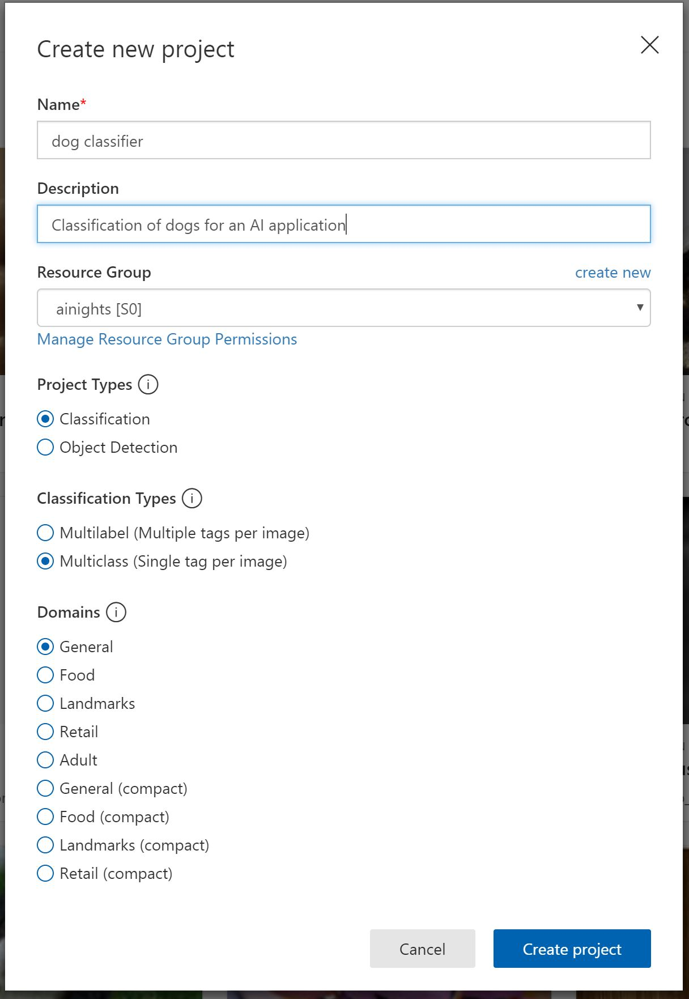
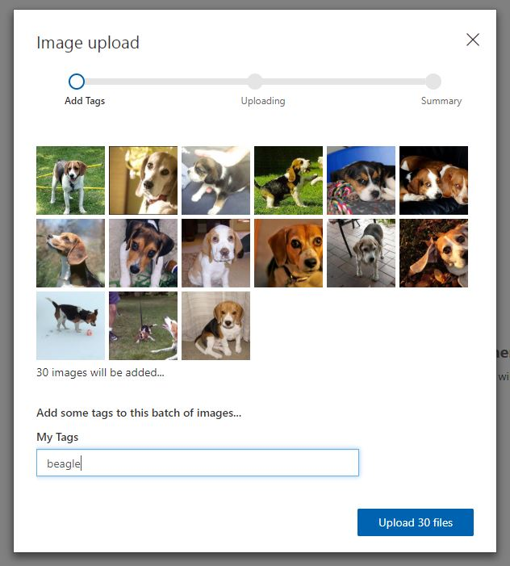
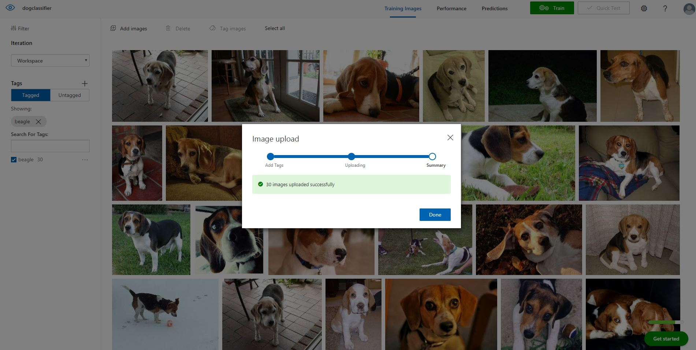
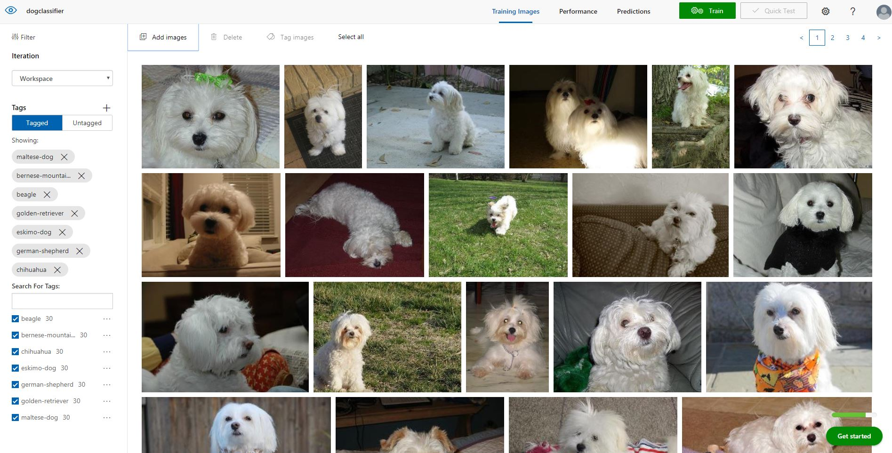
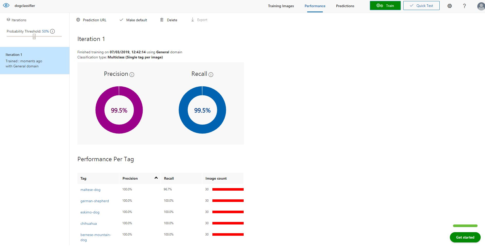
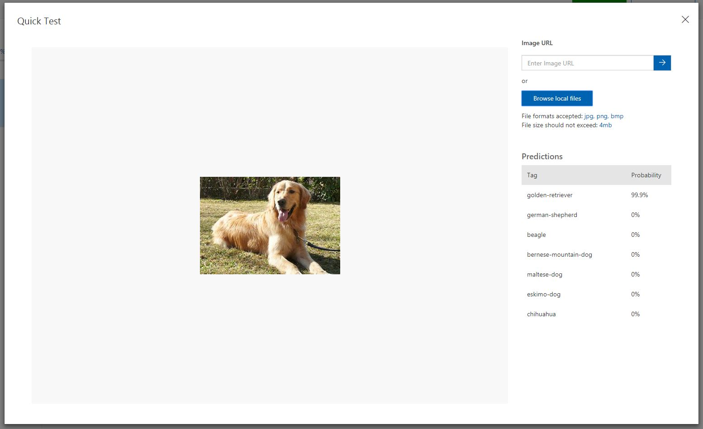
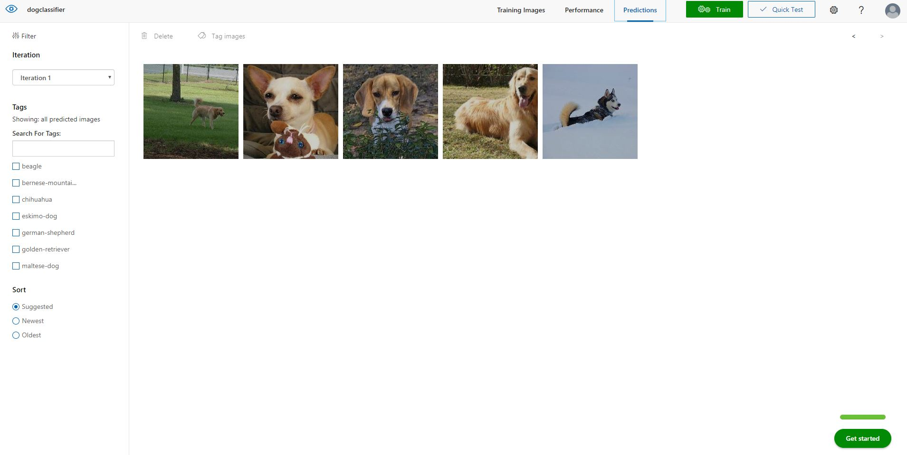
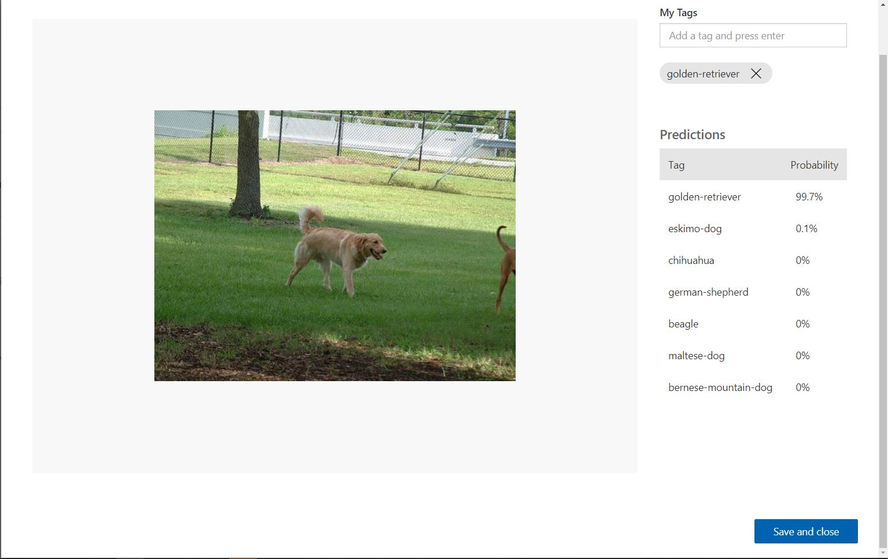
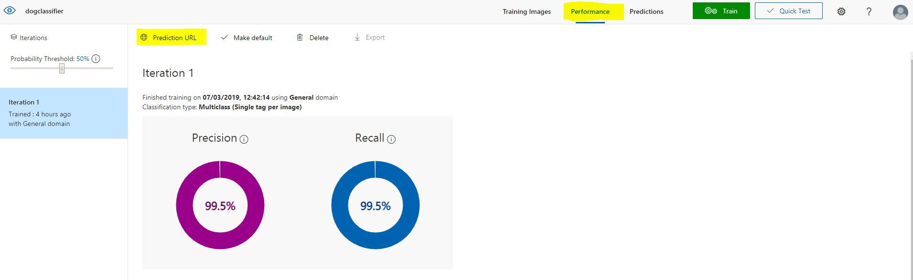
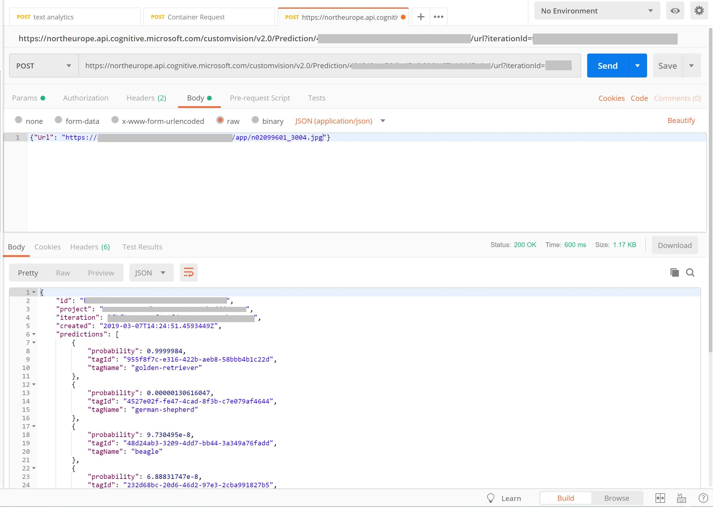

# AI Nights Content - Beginner Track
## Workshop for Attendees

## Session Information 
**Session Title:** Creating applications that can see, hear, speak or understand - using Microsoft Cognitive Services

**Session Abstract:** In this workshop you will be introduced to the [Microsoft Azure Cognitive Services](https://azure.microsoft.com/en-gb/services/cognitive-services/), a range of offerings you can use to infuse intelligence and machine learning into your applications without needing to build the code from scratch. 
We will cover pre-trained AI APIs, such as [computer vision](https://azure.microsoft.com/en-gb/services/cognitive-services/directory/vision/) and [text analytics](https://azure.microsoft.com/en-gb/services/cognitive-services/directory/lang/), that are accessed by REST protocol. Then look at how you can host these [models in containers](https://docs.microsoft.com/en-us/azure/cognitive-services/cognitive-services-container-support), giving you the ability to run Cognitive Services offline and on edge devices. Finally we will dive into Custom AI that uses transfer learning - [Microsoft Azure Custom Vision](https://azure.microsoft.com/en-gb/services/cognitive-services/custom-vision-service/). This enables you to provide a small amount of your own data to train an image classification model. Wrapping the workshop up by building our custom trained AI into an application - using [Logic Apps](https://azure.microsoft.com/en-gb/services/logic-apps/), this technology is ideal for proof of concepts within machine learning


## Pre-requisites for your machine
* Clone this repository to your local machine to gain images and code samples you need for the demos: ```git clone https://github.com/amynic/AINights.git```
* [Microsoft Azure Subscription](https://azure.microsoft.com/en-gb/free/)
* Laptop with a modern web browser (Google Chrome, Microsoft Edge)
* [Postman, API Development Environment - available on Windows, Linux and macOS](https://www.getpostman.com/downloads/)

> *All demos and content have been tested on a Windows PC, however all options should run from macOS and Linux machines as well. Please provide information via an issue or pull request if you have feedback on other operating systems*  

## Task 1: Microsoft Azure Cognitive Services - Computer Vision

In this task you will try out the Cognitive Services using the website demo options

Navigate to: [https://azure.microsoft.com/en-gb/services/cognitive-services/directory/vision/](https://azure.microsoft.com/en-gb/services/cognitive-services/directory/vision/)


There are lots of different demos to try in each section (Scene and Activity Recognition in Images, OCR, Face Detection, Emotion Detection, Video indexer etc)

Select the **Demo** link next to **Scene and activity recognition in images** under **Computer Vision**. There are also other demo links to explore the different services


Now select **Browse** button and upload the **cat.jpeg** or **city.jpeg** image from ```sample-images/computer-vision-web-browser/cat.jpeg```


## Task 2: Microsoft Azure Cognitive Services - Text Analytics via REST

Now you will try using the REST protocol as you would use to integrate these services into an application

First log into [Microsoft Azure](https://azure.microsoft.com/en-gb/) and choose **Portal** in the top right corner.

Once in the portal select **Create a resource** and search **Cognitive Services** and choose Enter. Then select **Create** on the Cognitive Services blade


Enter details to create an account:
* **Name:** enter a suitable name for the service (example: ainightscognitive)
* **Subscription:** Choose your subscription
* **Location:** Choose your closest Data Center available
* **Pricing Tier:** S0
* **Resource Group:** Select 'Create new', and provide a sensible name (example ainights)
* **select the checkbox after reading the terms below**
* **select 'Create'**


Once created, in your notifications (top right corner) select **go to resource**


In the Cognitive Services page, select **Keys** and copy **KEY 1**


Now select **Overview** in the left hand pane and copy the **Endpoint** variable


Download and open Postman, an API Development environment on your local machine. 
> Find the download in the [Pre-requisites section](#Pre-requisites-for-your-machine)

Select **Request**


Enter request details as below and choose the option **create a new collection** and name it "Text Analytics Samples"


Select the newly created collection and choose save


Now create a request to call your text analytics API:
* Change from a GET request to a POST request in the top left
* Enter your endpoint URL and add ```text/analytics/v2.0/sentiment``` to the end
* Select Headers underneath the URL box
* In Key type ```Ocp-Apim-Subscription-Key``` and in Value add your KEY1 value
* In Key type ```Content-Type``` and in Value type ```application/json```
* 
* Select Body underneath the URL box
* Select ```raw``` from the radio button options
* Copy JSON sample from ```sample-code/text-analytics-demo/sentiment-analysis-text.json``` into the box
* Select the ```Send``` button and review the Response
* 

You can also try other options from the REST API - such as KeyPhrases function. Change the end of the URL from sentiment to keyPhrases and select send to view the key phrases for the example text.

* 

> Check out the language support for the Text Analytics API [here](https://docs.microsoft.com/en-gb/azure/cognitive-services/text-analytics/language-support). If your language is supported please edit the JSON file to translate the text and show the functionality of the API above. There is an example of a French JSON file in ```sample-code/text-analytics-demo/sentiment-analysis-text-fr.json``` please edit this file as appropriate

> If you have any issues running Postman, API Development Environment you can always run the REST API requests within the API docs for [sentiment analysis](https://northeurope.dev.cognitive.microsoft.com/docs/services/TextAnalytics.V2.0/operations/56f30ceeeda5650db055a3c9) and [key phrase extraction](https://northeurope.dev.cognitive.microsoft.com/docs/services/TextAnalytics.V2.0/operations/56f30ceeeda5650db055a3c6). Select the data centre you are using and then enter your key in the box provided along with the sample body sample used in Postman

## Task 3: Microsoft Azure Cognitive Services - Custom Vision

Using Microsoft Azure Custom Vision service you can start to build your own personalised image classification and object detection algorithms with very little code. In this exercise we will create a dog-breed classification algorithm using Dog images from the [ImageNet open dataset created by Standford University](http://vision.stanford.edu/aditya86/ImageNetDogs/)

We have 7 Classes of dogs each with 30 images (available in a .zip file [here](sample-images/dogs.zip))
* Beagle
* Bernese Mountain Dog
* Chihuahua
* Eskimo Dog (aka Husky)
* German Shepherd 
* Golden Retriever
* Maltese

There is also a set of test images (not for training) in this [.zip folder](sample-images/dogs.zip).

First create a Custom Vision instance in your Azure account. 

* Go to the [Azure Portal](https://ms.portal.azure.com) main dashboard. 
* Click 'Create a Resource' in the top left
* Search for 'Custom Vision' 
* On the description pane for Custom Vision click Create.
* Enter details to create
    * a name for the service 
    * select your subscription 
    * **[IMPORTANT]** Please choose **SOUTH CENTRAL US** as the data centre
    * Choose the S0 tier for both 'Prediction pricing tier' and Training pricing tier
    * select the resource group you created previously for this project (e.g. ainights)
    * Click Create
* 

Now we can build our classifier, navigate to [https://www.customvision.ai](https://www.customvision.ai) and choose sign in. Sign in with your Azure credentials account

> Accept the terms and conditions box to continue

Once loaded choose 'New Project' which opens a window to enter details

* Name: choose a suitable name
* Description: add a description of the classifier (example shown in image below)
* Resource Group: choose the resource group you created your custom vision service in (example: ainights[SO])
* Project Types: Classification
* Classification Types: Multiclass (Single tag per image)
* Domains: General
* 

Choose 'Create Project' and you will land on an empty workspace like below


Now we can start adding images and assigning them tags to create our image classifier

In the top left, select 'Add images', browse for the first folder of images from the [.zip folder](sample-images/dogs.zip) - Beagle - and select all 30 of the images in the folder.

Add the tag 'beagle' to the Beagle dog images and select 'Upload 30 files'



Once successful you receive a confirmation message and you should see your images are now available in the workspace



Now complete the same steps of uploading and tagging images for the other 6 dog categories in the folder. For each type of dog:
* Click add images
* Select the 30 new dog images
* Add the class label (beagle, german-shepherd, maltese etc)
* choose upload
* confirm images uploaded into the workspace

Now you should have all categories uploaded and on the left hand side you can see your dog classes and you can filter depending on type of dog image



Now you are ready to train your algorithm on the dog image data you have uploaded. Select the green **'Train'** button in the top right corner

Once the training process is complete it will take you to the Performance tab. Here you will receive machine learning evaluation metrics for your model



Now we have a model we need to test the model. Choose the 'Quick Test' button in the top right *(next to the train button)* this will open a window where you can browse for a local image or enter a web URL.

Browse for an image in the test folder (images the model have not been trained on) and upload. The image will be analysed and a result returned of what dog the model thinks it is (prediction tag) and the models confidence of its result (prediction probability)



> Repeat this process for other images in the test folder to see how the model performs

If you click on the **'Predictions'** tab on the top toolbar - you should see all the test images you have submitted. This section is for re-training, as you get new data you can add this to your model to improve its performance. The images are ordered by importance - the image, which if classified correctly, will add the most new information to the model is listed first. Whereas the last image might be very similar to other images already learnt by the model so this is less important to classify correctly.



To add these images to the model - select the first image, review the results the model provided and then in the 'My Tags' box enter the correct tag and click 'save and close'



This image will disappear from the  your predictions workspace and be added to the training images workspace. Once you add a few new images and tags you can re-train the model to see if there are improvements.

To use this model within applications you need the prediction details. Go to the performance tab from the top bar and select Prediction URL



Select this and you have the information you need to create a Postman call to your API (using both an image or an image URL)



**Great work!** you have created your specialised dog classification model using the Azure Custom Vision Service
